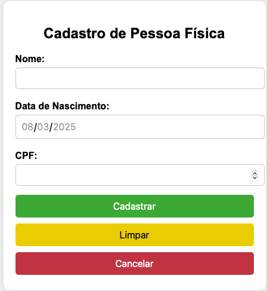
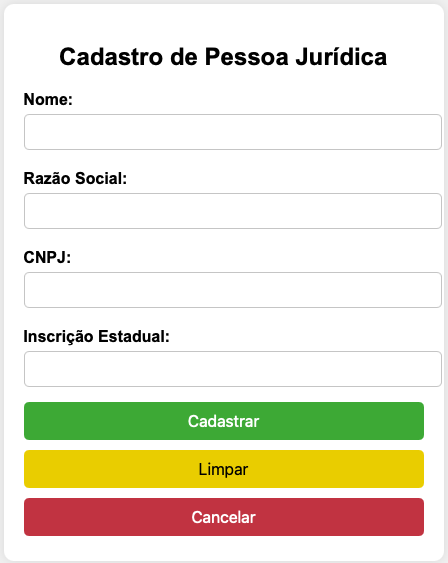
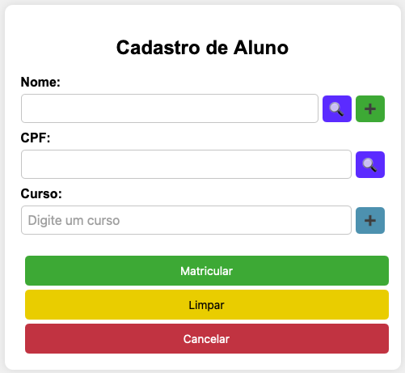
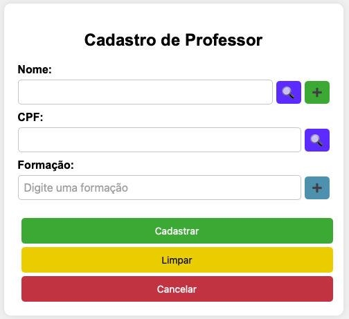
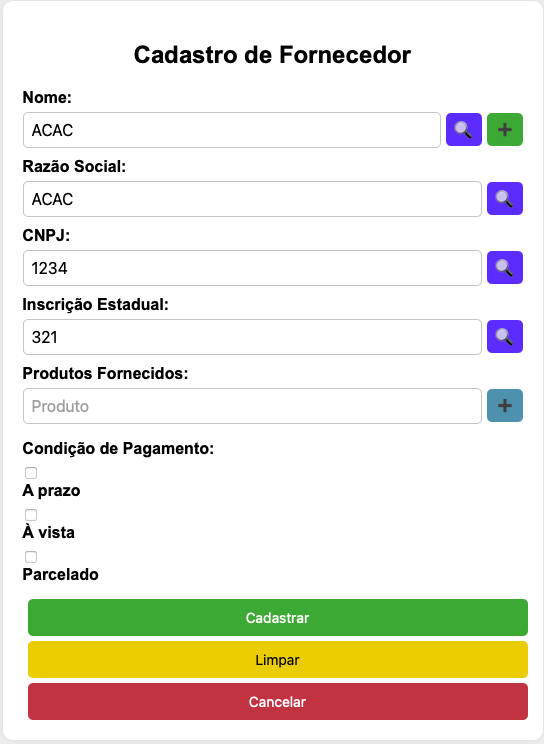
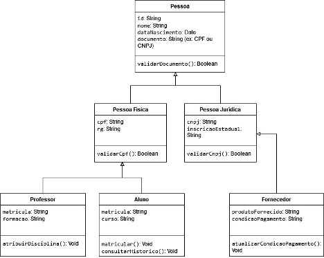

# PI_2404_GRP6

Este repositório tem como objetivo armazenar os protótipos de telas e a codificação do software definido pelo grupo na primeira etapa do Projeto Integrador.

## Integrantes

- **Micheline Soares de Lima**
- **Cleiton Conde Pinto**
- **Victor Hugo Milani**

## Prototipo de Telas
### - Tela Inicial

### - Cadastro de Pessoa Física

### - Cadastro de Pessoa Juridica

### - Cadastro de Aluno

### - Cadastro de Professor

### - Cadastro de Fornecedor

## Diagrama de Classe

